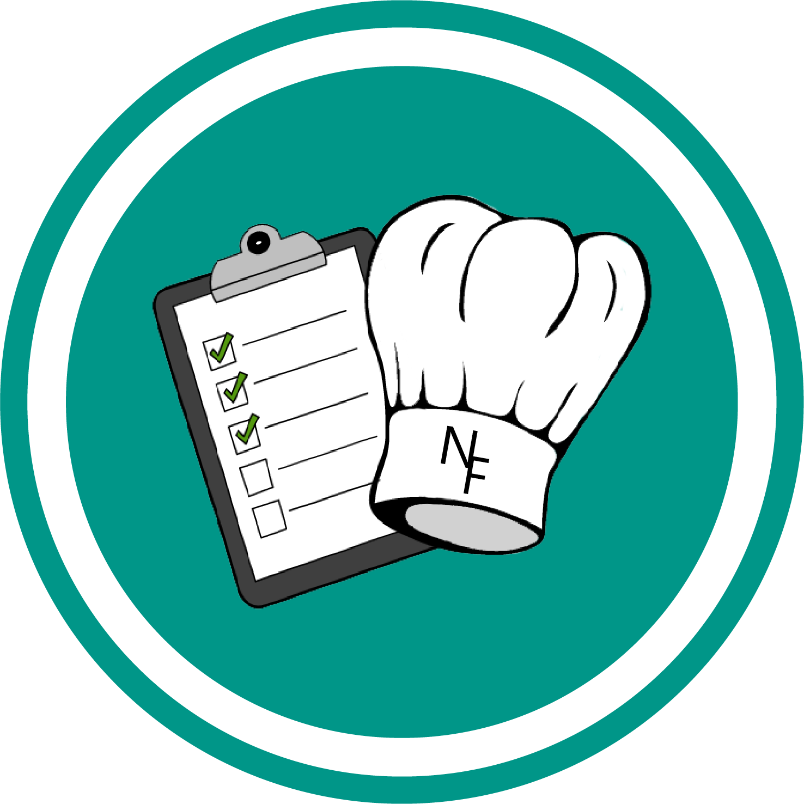

<!-- Improved compatibility of back to top link: See: https://github.com/othneildrew/Best-README-Template/pull/73 -->
<a name="readme-top"></a>
<!--
*** Thanks for checking out the Best-README-Template. If you have a suggestion
*** that would make this better, please fork the repo and create a pull request
*** or simply open an issue with the tag "enhancement".
*** Don't forget to give the project a star!
*** Thanks again! Now go create something AMAZING! :D
-->

<!-- PROJECT LOGO -->
<br />
<div align="center">
  <a href="https://github.com/DarkRose2021/RecipeApp">
    
  </a>

<h3 align="center">NeuFoods</h3>

  <p align="center">
    This is a recipe app that's made with flutter. This app can let you view recipes, search recipes, create meal plans, add recipes, generate a shopping list, and more!
    <br />
    <a href="https://github.com/DarkRose2021/RecipeApp"><strong>Explore the docs »</strong></a>
    <br />
    <br />
    <a href="https://github.com/DarkRose2021/RecipeApp">View Demo</a>
    ·
    <a href="https://github.com/DarkRose2021/RecipeApp/issues/new?labels=bug&template=bug-report---.md">Report Bug</a>
    ·
    <a href="https://github.com/DarkRose2021/RecipeApp/issues/new?labels=enhancement&template=feature-request---.md">Request Feature</a>
  </p>
</div>


<!-- TABLE OF CONTENTS -->
<details>
  <summary>Table of Contents</summary>
  <ol>
    <li>
      <a href="#about-the-project">About The Project</a>
      <ul>
        <li><a href="#built-with">Built With</a></li>
      </ul>
    </li>
    <li>
      <a href="#getting-started">Getting Started</a>
      <ul>
        <li><a href="#prerequisites">Prerequisites</a></li>
        <li><a href="#installation">Installation</a></li>
      </ul>
    </li>
    <li><a href="#usage">Usage</a></li>
    <li><a href="#roadmap">Roadmap</a></li>
    <li><a href="#contributing">Contributing</a></li>
    <li><a href="#license">License</a></li>
    <li><a href="#contact">Contact</a></li>
    <li><a href="#acknowledgments">Acknowledgments</a></li>
  </ol>
</details>


<!-- ABOUT THE PROJECT -->
## About The Project

<!--[![Product Name Screen Shot][product-screenshot]](https://example.com)-->

<p align="right">(<a href="#readme-top">back to top</a>)</p>


### Built With

* [](https://skillicons.dev)
* [](https://skillicons.dev)

<p align="right">(<a href="#readme-top">back to top</a>)</p>


<!-- GETTING STARTED -->
## Getting Started

This is an example of how you may give instructions on setting up your project locally.
To get a local copy up and running follow these simple example steps.

### Prerequisites

- Flutter SDK: [Install Flutter](https://flutter.dev/docs/get-started/install)
- A code editor (e.g., Visual Studio Code or Android Studio)

### Installation

1. Get a free API Key at [spoonacular](https://spoonacular.com/food-api)
2. Clone the repo
   ```sh
   git clone https://github.com/DarkRose2021/RecipeApp.git
   ```
3. Install dependencies
   ```sh
   flutter pub get
   ```
4. Create a .env file in the root directory
5. Enter your API key in `.env`
   ```.env
   API_KEY = 'ENTER YOUR API';
   ```

<p align="right">(<a href="#readme-top">back to top</a>)</p>


<!-- USAGE EXAMPLES -->
## Usage

To run the app on an emulator or physical device:

1. Ensure a device is connected or an emulator is running.
   - See Flutter Docs for more information: [Windows](https://docs.flutter.dev/get-started/install/windows/mobile) | [Andriod](https://medium.com/@aftabaminzoobiapps/how-to-run-flutter-apps-on-android-devices-f80ebac95f45)
3. Execute the following command in the project directory:
    ```sh
    flutter run
    ```

<p align="right">(<a href="#readme-top">back to top</a>)</p>


<!-- ROADMAP -->
## Roadmap

- [ ] Generate a shopping list
- [ ] Update some UI/UX features
- [ ] Add a backend
    - [Go Here for more Info](https://github.com/DarkRose2021/RecipeApp-Backend)
- [ ] Signup
- [ ] Login
- [ ] Create Recipes
- [ ] Create Meal Plans
- [ ] View Meal Plans

See the [open issues](https://github.com/DarkRose2021/RecipeApp/issues) for a full list of proposed features (and known issues).

<p align="right">(<a href="#readme-top">back to top</a>)</p>


<!-- CONTRIBUTING -->
## Contributing

Contributions are what make the open source community such an amazing place to learn, inspire, and create. Any contributions you make are **greatly appreciated**.

If you have a suggestion that would make this better, please fork the repo and create a pull request. You can also simply open an issue with the tag "enhancement".
Don't forget to give the project a star! Thanks again!

1. Fork the Project
2. Create your Feature Branch (`git checkout -b feature/AmazingFeature`)
3. Commit your Changes (`git commit -m 'Add some AmazingFeature'`)
4. Push to the Branch (`git push origin feature/AmazingFeature`)
5. Open a Pull Request

<p align="right">(<a href="#readme-top">back to top</a>)</p>


<!-- LICENSE -->
## License

Distributed under the MIT License. See `LICENSE.txt` for more information.

<p align="right">(<a href="#readme-top">back to top</a>)</p>


<!-- CONTACT -->
## Contact

<!--Your Name - [@twitter_handle](https://twitter.com/twitter_handle) - email@email_client.com-->

Project Link: [https://github.com/DarkRose2021/RecipeApp](https://github.com/DarkRose2021/RecipeApp)

<p align="right">(<a href="#readme-top">back to top</a>)</p>

